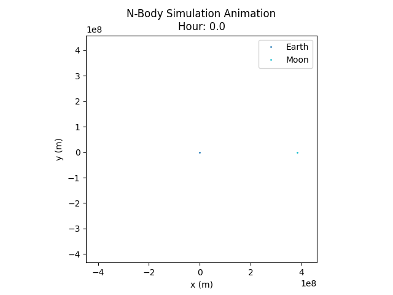

# N-Body Simulation

This project simulates the gravitational interaction of multiple bodies (n-body problem) using C++20. It features modular design, unit tests, and CSV output for easy visualization.


<div style="display: flex; gap: 10px; justify-content: center; align-items: center; width: 100%;">
	
	
</div>

## Features
- Modular C++20 codebase
- Euler integrator (easily extensible)
- Google Test integration
- CSV output for visualization
- Configurable initial conditions via text files

## Build Instructions

### Prerequisites
- CMake >= 3.20
- C++20 compatible compiler (e.g., g++ 10+)
- Make

### Build and Run
```sh
make           # Build the project
make run       # Run the simulation (outputs to terminal)
make test      # Run all unit tests
```

## Project Structure
- `src/`         - Source files
- `include/`     - Header files
- `tests/`       - Unit tests (Google Test)
- `data/`        - Example configuration files
- `output.csv`   - Example output file (generated)
- `scripts/`     - Python scripts for visualization

## Configuration Files
Configuration files (e.g., `data/earth_moon.txt`, `data/sun_mercury_venus_earth_mars.txt`) are space-separated text files:
```
# name mass x y z vx vy vz radius
Earth 5.972e24 0 0 0 0 0 0 0 6371000
Moon 7.348e22 384400000 0 0 0 1022 0 1737000
```

Example: `data/sun_mercury_venus_earth_mars.txt`
```
# name mass x y z vx vy vz radius
Sun 1.9885e30 0 0 0 0 0 0 0 696340000
Mercury 3.3011e23 57910000000 0 0 0 47900 0 2439700
Venus 4.8675e24 108200000000 0 0 0 35000 0 6051800
Earth 5.9724e24 149600000000 0 0 0 29800 0 6371000
Mars 6.4171e23 227900000000 0 0 0 24100 0 3389500
```

## Output
Simulation results can be written to a CSV file for visualization. Each row contains:
```
time,body_name,x,y,z,vx,vy,vz
```


### Python Visualization
To visualize the simulation output, use the provided Python script:


To visualize the simulation output, use the provided Python script:

```sh
cd scripts
python3 -m venv .venv
source .venv/bin/activate
pip install -r requirements.txt
python plot_output.py ../output/earth_moon.csv
python plot_output.py ../output/sun_mercury_venus_earth_mars.csv
```
This will plot the trajectories of all bodies using matplotlib.

You can also use Excel or any plotting tool to visualize `output.csv`.

## License
This project is licensed under the [MIT License](LICENSE).
